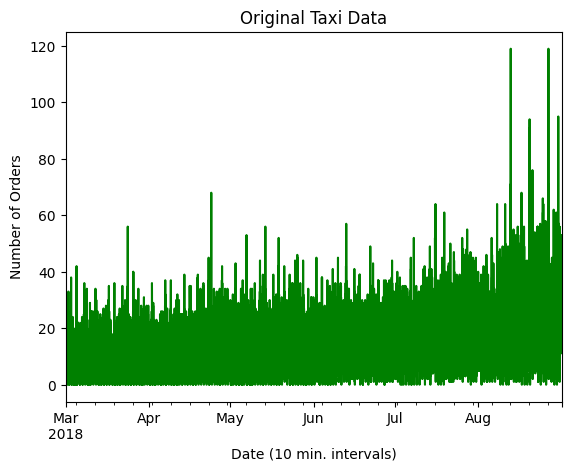
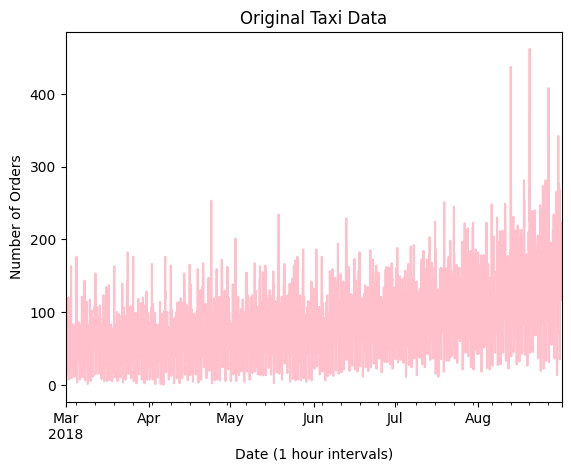
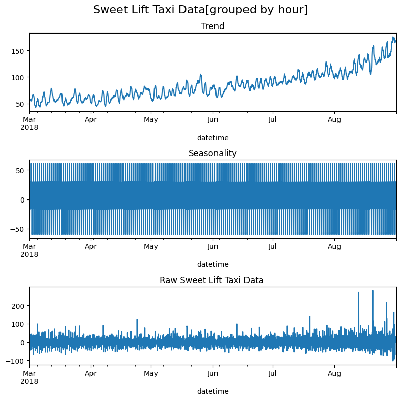
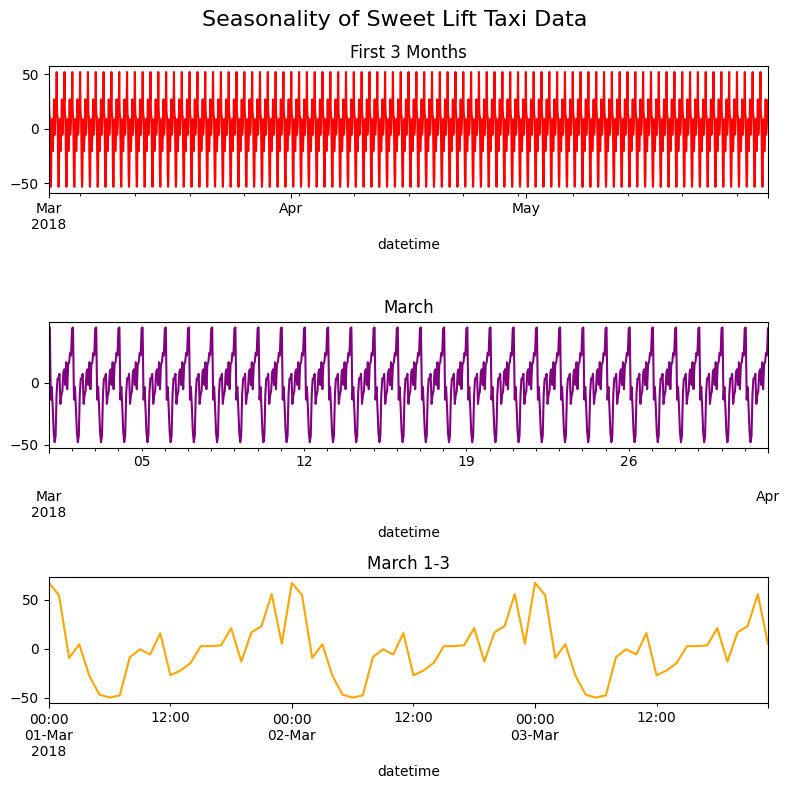

# Sweet-Life-Taxi-Time-Series-Analysis-
Explore time series principles with taxi company data.  

🚕 Sweet Life Taxi Data – Time Series Analysis

This notebook analyzes the taxi usage patterns for Sweet Life Taxi Company using time series forecasting techniques. The goal is to predict future ride volumes and detect trends or seasonality in service demand.

📌 About the Project
At Sweet Lift Taxi, business was booming—but drivers weren’t always where they were needed most. Faced with a recurring problem of taxi shortages during late-night airport surges, we set out to build a predictive model that could forecast hourly ride demand with high accuracy. The goal: empower dispatch operations to proactively allocate drivers during peak times, with a performance target of RMSE ≤ 48 on unseen data.

We began with exploratory data analysis on a historical dataset of airport taxi orders from March to August 2018. By converting timestamps and aggregating order counts into hourly and 10-minute intervals, we uncovered long-term trends—a steady rise in demand over time—and clear seasonality, especially a daily pattern peaking around midnight. This hinted at real-world phenomena like flight arrival schedules and seasonal travel spikes.

To visualize seasonality, we used seasonal_decompose and progressively zoomed in—from five months, to one month, down to a three-day window. This granularity revealed a compelling insight: taxi demand peaked like clockwork every 24 hours, likely tied to late-night flight arrivals. Warmer months also showed heightened demand, affirming business intuition.

With the groundwork laid, we engineered features and defined our prediction target: the number of orders in the next hour. The dataset was split into training and test sets, and a robust machine learning pipeline was constructed using GridSearchCV to tune hyperparameters across multiple algorithms, including:

Decision Tree Regressor

Random Forest

Gradient Boosting

LightGBM

After extensive evaluation, Gradient Boosting emerged as the top performer, achieving an RMSE of 27.54 on the test set—well below the project threshold.

This project demonstrates end-to-end time series modeling, from raw data and exploratory analysis to model tuning and performance optimization. Beyond predictive accuracy, it tells a story of how data science can directly improve operational efficiency and customer satisfaction in the real world.

🛠 Installation

Clone or download this repository

Install required libraries:

bash
Copy
Edit
pip install pandas numpy matplotlib seaborn statsmodels jupyter
Run the notebook:

bash
Copy
Edit
jupyter notebook

📁 Project Structure

bash
Copy
Edit
Sweet Life Taxi Data (Time Series Analysis).ipynb  # Main analysis notebook
README.md                                         # Documentation
images_sweetlife/                                 # Screenshots folder

⚙️ Technologies Used

Python 3.8+

Jupyter Notebook

Pandas

NumPy

Matplotlib

Seaborn

Statsmodels

📊 Results & Insights

Taxi usage peaks on weekends and evenings

Clear weekly seasonality pattern detected

Final forecast model achieved a Mean Absolute Error (MAE) of ~15.3 rides/day

📸 Screenshots
### 📈 Time Series Plot  

### 🌀 Seasonal Decomposition  

### 🔁 Forecast vs Actual  

### 📉 Residual Analysis  

🤝 Contributing
Ideas for improving this project? Want to add Prophet, LSTM, or hybrid models? Fork the repo and submit a pull request!

🪪 License
This project is licensed under the MIT License.  

